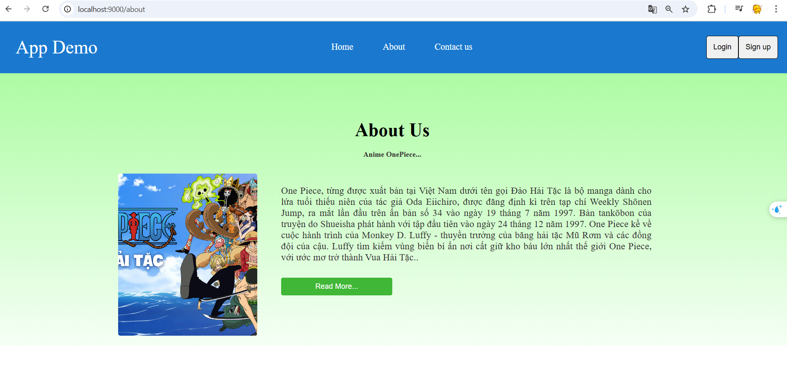
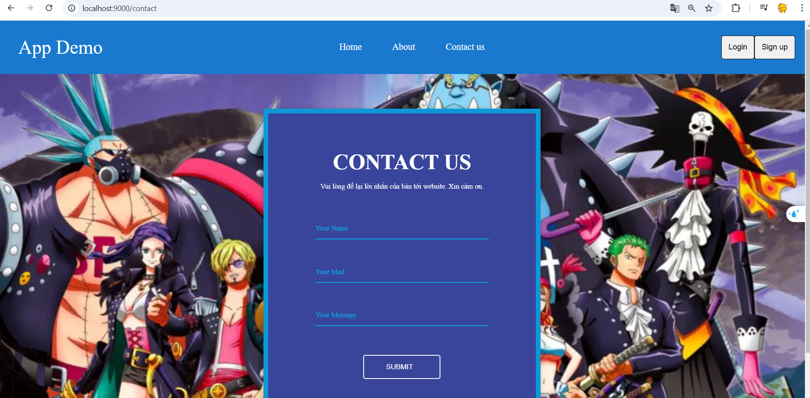
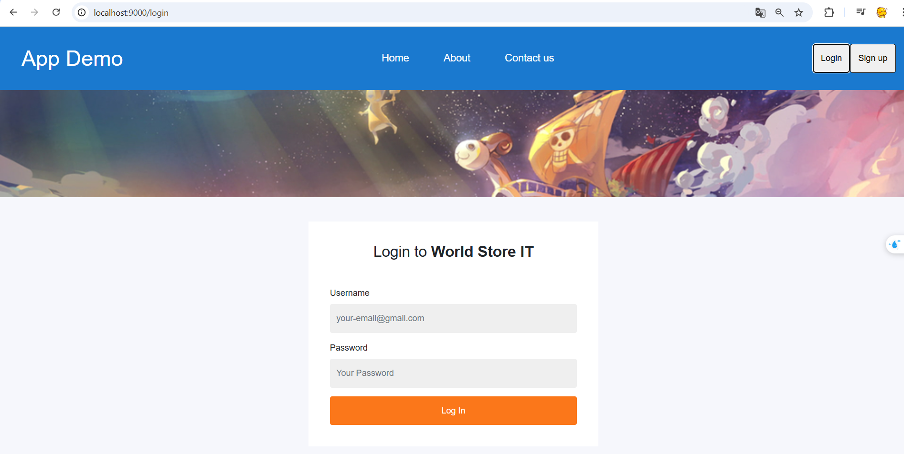
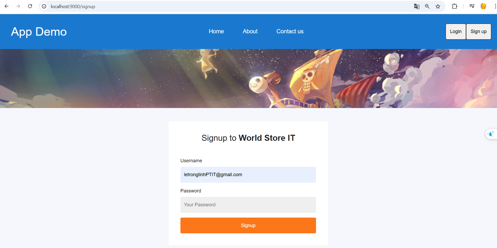

# Micro-frontend-app
## 📌 Mô tả
Dự án sử dụng kiến trúc **Micro-Frontend**, gồm **5 micro-apps**, mỗi app tương ứng với một view.

## 🚀 Cách chạy project
- **Chạy Container App**: `npm run start`
- **Chạy các Micro-Apps**: `npm run serve`

## 🖥️ Giao diện ứng dụng
**1️⃣ Home**   
**2️⃣ About**   
**3️⃣ Contact Us**   
**4️⃣ Login**   
**5️⃣ Signup** 